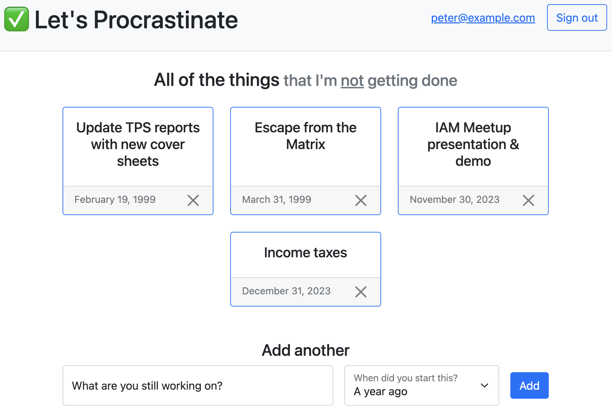
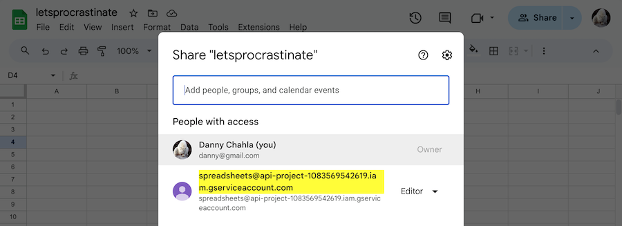

# Let's Procrastinate | Chapter 0: `Only Passwords`

> The story of how a simple website went from using only passwords to deploying passkeys.

Introducing **Let's Procrastinate**! The web app that lets you track all of the things you're actively not getting done.



Unfortunately, users of this version of the website can only authenticate with a password. But all that is about to change 🙂...

Once you get this version [set up](#setup) and [running](#run), turn the page to the [**➡️ next chapter**](https://github.com/twistedstream/lets-procrastinate/tree/1_offering-passkeys) of our story where we invite our users to "go passwordless" with passkeys:

```shell
git checkout 1_offering-passkeys
```

## Setup

The following instructions will assume you're running the server locally. See the [Docker](#docker) section for production environments.

**Prerequisites for running locally**
1. Install [Node](#node)
1. Install [dependencies](#dependencies)
1. Create a local `.env` file or rename [.sample.env](#.sample.env) to `.env`

**Environment variables**
1. Fill in your own environment variables specified in [CONFIG](./CONFIG.md).
2. ✅ Test config correctness by running the following command at any point. 
   ```shell
   npm run schema:apply:dry-run
   ```
   

---

**For those new to the Spreadsheet's API**

The sample uses a Google Sheets spreadsheet as its backend database. Here's how to set it up:

1. Create an empty [Google Sheets spreadsheet](https://docs.google.com/spreadsheets)

1. Follow the steps in the [Data](./CONFIG.md#data) section of CONFIG to create a Google service account and set the corresponding variables in the `.env` file
1. Share the spreadsheet with the service account so it has `Editor` access
 

1. Set the [`GOOGLE_SPREADSHEET_ID`](./CONFIG.md#google_spreadsheet_id) variable in the `.env` file
1. Run the following script to provision the spreadsheet with the correct schema:

   ```shell
   npm run schema:apply
   ```
---


### Node

Install the version of Node.js specified in the [`.nvmrc`](./.nvmrc) file. The easiest way to do this is use the [nvm](https://github.com/nvm-sh/nvm) tool:

```shell
nvm install
nvm use
```

### Self-signed TLS certificate

When running in local development mode, the server uses HTTPS with a self-signed certificate for TLS communication. Generate and install the certificate using these commands:

```bash
mkdir ./cert
./scripts/create-dev-cert.sh
./scripts/install-dev-cert.sh
```

This creates a `dev.crt` (certificate) and `dev.key` (private key) file in the `./cert` directory. It also installs the certificate so its trusted by your local machine.

### DNS

Add the following line to the `/etc/hosts` file:

```text
127.0.0.1  letsprocrastinate.dev
```

### Dependencies

Install dependencies

```shell
npm install
```

## Run

Now we can finally run the sample!

```shell
npm run dev
```

## Docker

You can also run the server within Docker since it comes with a [Dockerfile](./Dockerfile).

### Local Docker

To run the server in Docker locally (eg. using [Docker Desktop](https://www.docker.com/products/docker-desktop/)), you can use the following commands:

| Command                    | Description                                     |
| -------------------------- | ----------------------------------------------- |
| `npm run image:build`      | Build the image.                                |
| `npm run image:remove`     | Remove the image.                               |
| `npm run container:run`    | \* Start a container based on the image         |
| `npm run container:logs`   | Tail the logs of the current running container. |
| `npm run container:stop`   | Stop the currently running container.           |
| `npm run container:ssh`    | SSH into the currently running container.       |
| `npm run container:remove` | Remove the current container.                   |

\* Use a `.docker.env` file to feed the necessary [environment variables](#environment) into the container. See the [`Dockerfile`](./Dockerfile) for environment variables that are automatically being exported by Docker (eg. `PORT`).
